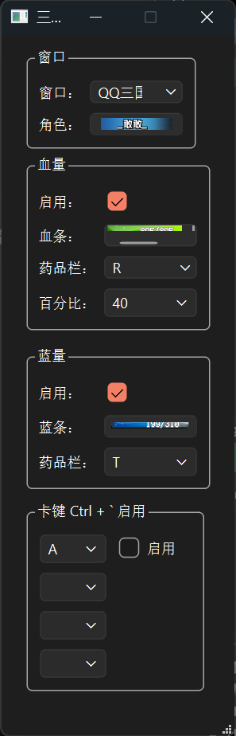

# 三国魔手

## 介绍

基于图片识别的自动加血、回蓝、卡键实现

检测血条/蓝条，采用图片二值化，判断灰度是否达到一定阈值实现

## 安装依赖

```bash
pip install -r requirements.txt
```

## 构建exe

```bash
pyinstaller  --noconfirm --onefile --windowed  window.py --hidden-import PySide6.QtSvg -n sg-helper.exe
```

## 编辑ui

```bash
pyside6-designer sg-util.ui
```

生成py文件
```bash
pyside6-uic sg-util.ui -o ui.py
```


# 运行截图

